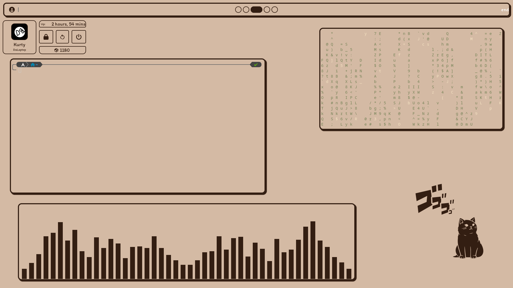

# Wol.py
## This is currently in Working Progress
### Updates are slow since I'm studdying for my degree...
- my archlinux dotfiles using Hyprland and Fabric

### Themes

#### Creme (Light)

#### Coffee (Dark)

